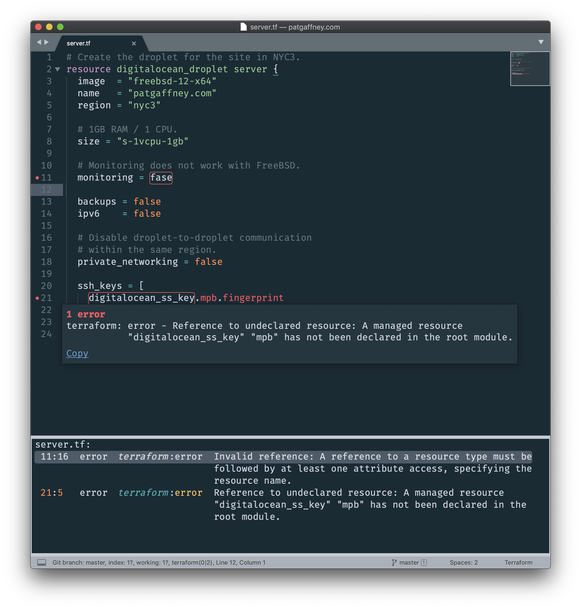

SublimeLinter-contrib-OpenTofu
================================

This linter plugin for [SublimeLinter](https://github.com/SublimeLinter/SublimeLinter) provides an interface to [OpenTofu `validate`](https://opentofu.org/docs/cli/commands/validate/). It will be used with files that have the `.tofu` and for backwards compatibility the `.tf` syntax.

## Installation

SublimeLinter must be installed in order to use this plugin. 

Please use [Package Control](https://packagecontrol.io) to install the linter plugin.

Before installing this plugin, you must ensure that `OpenTofu` is installed on your system. This plugin requires a **minimum version** of v0.12.x for `OpenTofu`. All versions before that lack the ability to have the `validate` command return JSON output, which this plugin relies on.

In order for `OpenTofu` to be executed by SublimeLinter, you must ensure that its path is available to SublimeLinter. The docs cover [troubleshooting PATH configuration](http://sublimelinter.readthedocs.io/en/latest/troubleshooting.html#finding-a-linter-executable).

## Settings

- SublimeLinter settings: http://sublimelinter.readthedocs.org/en/latest/settings.html
- Linter settings: http://sublimelinter.readthedocs.org/en/latest/linter_settings.html

Additional SublimeLinter-OpenTofu settings:

- *none at this time*
